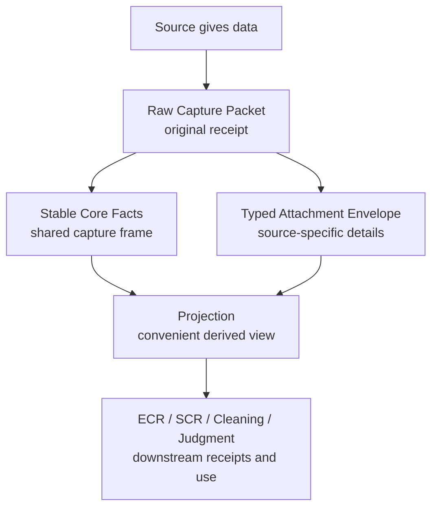

# Source Capture Core Payload Split Explainer v0

```yaml
retrieval_header_version: 1
artifact_role: Product artifact
scope: >
  Plain-language explanation of why Source Capture separates stable core facts
  from tenant/source-family typed payload attachments, and what that split does
  and does not decide for the broader data lake.
use_when:
  - Explaining the capture packet, SourceCaptureSlice, and attachment-envelope split to a non-data specialist.
  - Checking whether the accepted payload boundary affects the whole data lake or only capture-payload attachment.
  - Preparing the next data-lake mechanics planning lane without reopening the attachment-boundary decision.
authority_boundary: retrieval_only
open_next:
  - docs/product/data_capture_spine/source_capture_tenant_payload_attachment_boundary_v0.md
  - docs/workflows/data_capture_spine_consolidation_map_v0.md
stale_if:
  - A later accepted data-lake mechanics architecture changes the capture-to-projection-to-ECR/Cleaning flow.
  - A later accepted storage decision physicalizes packet/slice-keyed extension envelopes.
  - SourceCaptureSlice stops being the shared capture-slice surface.
```

## Status

`PLAIN_LANGUAGE_COMPANION_TO_ACCEPTED_BOUNDARY_V0`.

This is an explainer for the accepted Source Capture tenant-payload boundary.
The controlling architecture contract remains
`docs/product/data_capture_spine/source_capture_tenant_payload_attachment_boundary_v0.md`.

This artifact does not decide the full data-lake storage design, projection
cache design, ECR design, Cleaning design, Judgment design, migration path, or
runtime implementation.

## Start Preflight

```yaml
orca_start_preflight:
  agents_read: yes
  overlay_read: yes
  source_pack: custom (accepted source-capture payload boundary plus data-capture map)
  edit_permission: docs-write
  target_scope:
    - docs/product/data_capture_spine/source_capture_core_payload_split_explainer_v0.md
    - docs/workflows/data_capture_spine_consolidation_map_v0.md
  dirty_state_checked: yes
  isolation: existing clean worktree branch codex/source-capture-tenant-payload-boundary
external_source_boundary: workflow skills are task-local mechanics only; Orca authority remains AGENTS.md, the overlay, and accepted Orca docs.
doctrine_propagation_expected: no (plain-language companion; no new architecture decision)
```

## The Simple Idea

Every capture needs one shared frame plus source-specific detail.

```text
Source gives data
  -> raw capture packet
     -> stable core facts
     -> typed source-specific attachment
  -> projection reads both
  -> downstream systems use traceable derived views and receipts
```

The split exists so new sources can add their own details without forcing the
whole lake to keep changing its core capture shape.

## What Each Piece Means

### Raw Capture Packet

The raw capture packet is the original receipt.

It preserves what was captured, from where, when, with what method, and with
what limitations or missing-data posture. Later systems should be able to trace
back to this packet instead of treating a downstream view as the original truth.

### Stable Core Facts

Stable core facts are the boring facts that almost every capture needs.

Examples:

- source family;
- capture time;
- target identity;
- raw packet or file reference;
- capture status;
- absence, refusal, limitation, or not-attempted posture;
- schema or contract version pins.

These belong in the shared capture frame because downstream systems need them
across many source families.

### SourceCaptureSlice

`SourceCaptureSlice` is the shared capture-slice surface for stable capture
facts and incumbent slice-level fields.

The accepted boundary does not say every current `SourceCaptureSlice` field is
perfect. It says current source-specific slice fields may remain as incumbent
reality, but they are not the default pattern for future source-specific data.

### Typed Attachment Envelope

A typed attachment envelope is the labeled place for source-specific details.

Examples:

- Instagram metrics and visibility details;
- Retail/PDP price, SKU, inventory, review, or product-page details;
- Reddit thread, comment, subreddit, and body-structure details;
- demand-series or source-family details that are not universal core facts.

The envelope stays tied to the raw packet and slice, and it carries labels such
as source family, payload kind, and payload schema version.

## Why Not Give Every Source Its Own World

A fully source-specific path can look simpler:

```text
IG data -> IG packet -> IG projection
Retail data -> Retail packet -> Retail projection
Reddit data -> Reddit packet -> Reddit projection
```

That becomes expensive when Orca needs to ask shared questions:

- What did we capture?
- Where did it come from?
- What raw packet proves it?
- Was the data missing, refused, blocked, stale, or out of scope?
- Can we replay or rebuild a downstream view?
- Which downstream judgment used which raw evidence?
- Can different source families feed one Cleaning or Judgment path?

The accepted shape keeps the shared frame shared, and gives only the
source-specific details their own source-specific box.

## Visual



## What This Changes

This changes the default answer to a future modeling question.

When a new source family needs special fields, the default is no longer:

```text
add more fields to SourceCaptureSlice
```

The default is:

```text
keep common facts in the shared capture frame
put source-specific facts in a typed attachment tied to packet/slice
let projection read both when it needs a convenient view
```

Direct `SourceCaptureSlice` additions still remain possible, but only when the
field is truly core across source families and the owner accepts that decision.

## What This Does Not Decide

This explainer does not decide:

- where packets physically live;
- whether envelopes are embedded in a manifest, stored as sidecars, or stored
  another way;
- whether old IG fields are migrated, frozen, dual-read, or replayed;
- the projection cache or materialization strategy;
- ECR schema or receipt mechanics;
- Cleaning tag schema or write location;
- SCR, Signal Content, or Judgment internals;
- production runtime, scheduler, dashboard, or storage engine.

Those belong in a separate data-lake mechanics planning lane.

## Next Lane Shape

The next lane should not reopen the core/payload split unless new evidence shows
the accepted boundary is wrong.

The next lane should answer mechanics questions such as:

- Capture lands where physically?
- What is the raw packet handle?
- What reads raw packet, slice, and attachment data?
- What exactly is a projection, and where is it stored if materialized?
- Where does ECR read from, and what receipt does it write?
- Where does Cleaning read from, and where do tags or cleaned handles attach?
- How do ECR, SCR, Cleaning, and Judgment keep raw-keyed traceability without
  copying source truth into competing sources of truth?

Until that lane is accepted, the safe mental model is:

```text
capture truth first
shared core facts plus source-specific attachments second
projection is a derived view
downstream systems write traceable receipts, not replacement source truth
```
